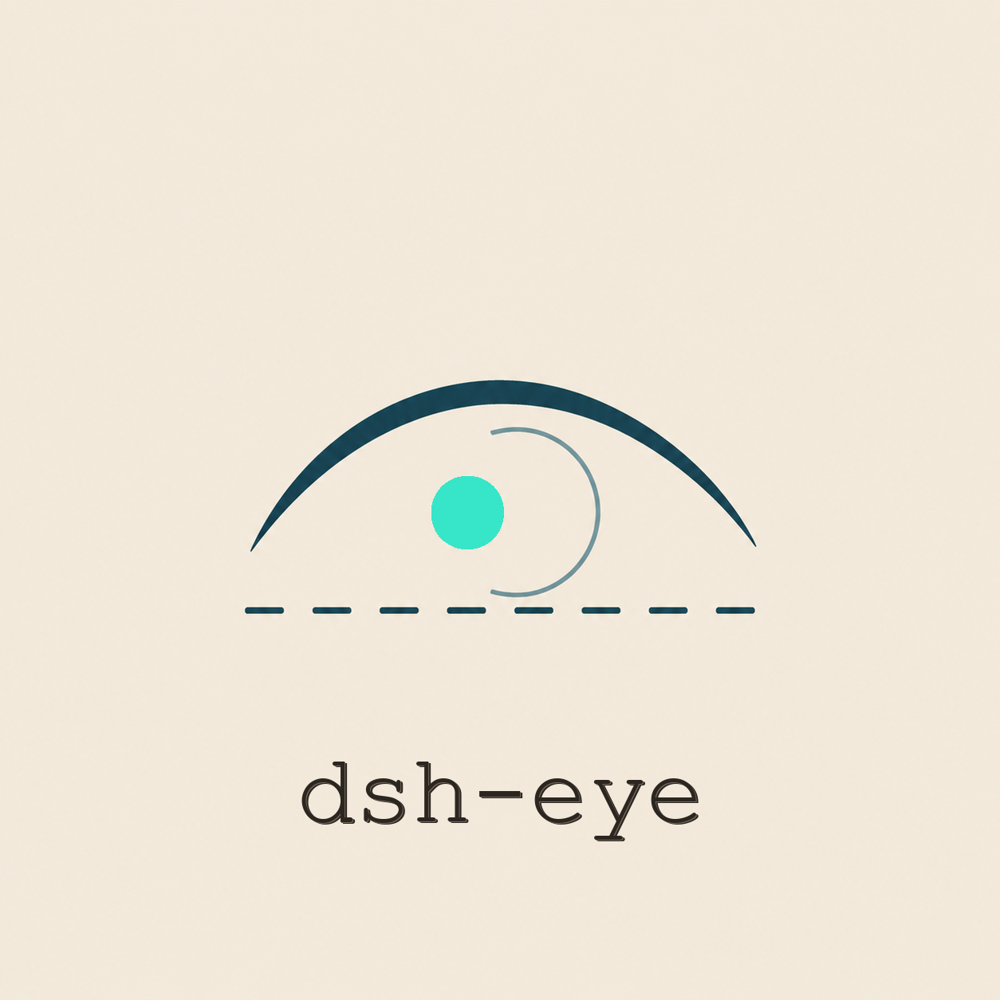

<div align="center">

**简体中文** | [English](README.en.md)



# dsh-eye

> 把每一个纯文本模型，变成能看图、能画画的完整 Agent。

**dsh-eye 是一个零依赖的 Agent Skill**：让 DeepSeek 这类不支持图片的模型，通过任意
**OpenAI 兼容端点**完成看图（描述 / 问答 / OCR）与画图（文字生成图片）。看图与画图
后端完全独立配置，一键向导，配置即时生效。


</div>

---

<details open>
<summary><b>📑 目录</b></summary>

- [快速开始（2 步，5 分钟）](#快速开始2-步5-分钟)
- [使用方式](#使用方式)
- [功能](#功能)
- [配置](#配置)
- [工作原理](#工作原理)
- [数据与隐私](#数据与隐私)
- [费用](#费用)
- [常见问题](#常见问题)
- [开发与测试](#开发与测试)
- [目录结构](#目录结构)
- [路线图](#路线图)
- [致谢](#致谢)
- [许可证](#许可证)

</details>

---

## 快速开始（2 步，5 分钟）

**PowerShell**

```powershell
git clone https://github.com/B-LIPSTICK/dsh-eye.git
cd dsh-eye
.\install.cmd
```

**cmd（命令提示符）**

```cmd
git clone https://github.com/B-LIPSTICK/dsh-eye.git
cd dsh-eye
install.cmd
```

> ⚠️ 两个终端命令**不一致**：PowerShell 需要 `.\` 前缀，cmd 不需要。不想记？直接**双击** `install.cmd` 也行。
> 运行后会自动安装到 skills 目录并启动配置向导——只需填 API Key，其余回车用免费默认（智谱）。完成后重启会话，分享图片路径 / URL 即可看图。

> ⚠️ **新手必读**：使用 DeepSeek 等纯文本模型时，**不要直接在对话框里粘贴图片**
> ——图片内容会被请求链路直接拒绝（`UNSUPPORTED_CONTENT`），每一轮都失败、还会
> 触发自动重试，**会话会卡死在"运行中"无法输入**（且持续消耗 API）。请发送图片的
> **文件路径或网址**（如 `看看这张图 C:\Users\你\Pictures\test.png`）。
>
> 🚑 **万一已经粘贴图片卡死了**：点输入框旁的**停止**按钮中断当前轮次；若停止后
> 仍自动重开失败轮次，**新开一个对话**继续（旧会话保持静止即可），并把图片路径 /
> URL 发过去。
>
> 💡 不用 git？网页 **Download ZIP** 解压后进文件夹跑 `install.cmd` 一样；
> 不想用向导？一条命令即可起步（默认智谱免费）：
> PowerShell：`$env:DASHEYE_API_KEY = "sk-xxx"` · cmd：`set DASHEYE_API_KEY=sk-xxx`
> 配置即时生效：脚本自动读取 `~/.dsh-eye.json` 与注册表，改完无需重启任何程序。

## 使用方式

**在对话里（最常用）**

```
看看这张图 C:\Users\你\Pictures\test.png
这张图里写了什么？https://example.com/a.png
帮我画一只赛博朋克风格的猫
```

**在命令行（直接调用）**

```bash
node dsh-eye/scripts/vision.mjs "C:\Users\me\Pictures\test.png"                    # 看图：描述
node dsh-eye/scripts/vision.mjs "a.png" "图里有多少只猫？" --mode ask              # 看图：提问
node dsh-eye/scripts/vision.mjs "scan.png" --mode ocr                              # 看图：OCR
node dsh-eye/scripts/generate.mjs "一只赛博朋克风格的猫，霓虹灯，雨夜"              # 画图
node dsh-eye/scripts/vision.mjs "a.png" --base-url ... --model ... --api-key ...   # 临时覆盖配置
```

## 功能

| | 看图（vision） | 画图（generation） |
|---|---|---|
| 脚本 | `vision.mjs` | `generate.mjs` |
| 能力 | 描述 · 视觉问答 · OCR | 文字 → 图片 |
| 端点 | OpenAI 兼容 `/chat/completions` | OpenAI 兼容 `/images/generations` |
| 预设 | `glm`（免费）· `qwen` · `openai` · `ollama` | `glm` · `qwen` · `openai` |
| 配置 | **与画图完全独立** | 可一键复用看图配置 |

- **零依赖**：只用 Node 内置模块（`fetch` / `fs` / `path`），复制即用
- **配置即时生效**：脚本自动读取用户级配置（`~/.dsh-eye.json` + Windows 注册表），
  改完配置无需重启任何程序，沙箱环境也能读到
- **友好错误**：缺 Key、格式异常、API 报错都有中文提示，并列出已检查的全部配置来源
- **不拒绝**：SKILL.md 明确要求模型"有工具就用"，从根上消除"模型不支持图片"的尴尬
- **来源三格式**：本地路径 / http(s) URL / data URI 全部支持

## 配置

配置来源优先级：**命令行参数 > 环境变量 > `~/.dsh-eye.json` > Windows 注册表 > 预设 > 内置默认**。

| 变量 | 用途 | 回退顺序 |
|---|---|---|
| `DASHEYE_BASE_URL` · `DASHEYE_MODEL` · `DASHEYE_API_KEY` | 看图 | 参数 > 环境变量 > 文件/注册表 > 预设 |
| `DASHEYE_GEN_BASE_URL` · `DASHEYE_GEN_MODEL` · `DASHEYE_GEN_API_KEY` | 画图 | 参数 > 环境变量 > 文件/注册表 > 看图配置 |
| `DASHEYE_GEN_OUT` | 画图输出目录 | 默认 storages / tmp |
| `DASHEYE_PRESET` / `DASHEYE_GEN_PRESET` | 看图 / 画图预设 | — |
| `OPENAI_API_KEY` | 通用兜底 Key | — |

常用端点速查：

| 预设 | 看图端点 | 看图模型 | 画图模型 |
|---|---|---|---|
| `glm` | `open.bigmodel.cn/api/paas/v4` | `glm-4v-flash`（免费） | `cogview-3-flash` |
| `qwen` | `dashscope.aliyuncs.com/compatible-mode/v1` | `qwen-vl-max` | `wanx2.1-t2i-flash` |
| `openai` | `api.openai.com/v1` | `gpt-4o` | `gpt-image-1` |
| `ollama` | `localhost:11434/v1`（本地） | `llava` | — |

## 工作原理

```text
Agent 会话（DeepSeek 等纯文本模型）
   │  用户：看看这张图 C:\x\a.png
   ▼
dsh-eye skill（SKILL.md 触发）
   │  node scripts\vision.mjs "C:\x\a.png"
   ▼
vision.mjs
   │  ① 读取配置：参数 > 环境变量 > ~/.dsh-eye.json > 注册表 > 预设
   │  ② 读取图片字节 → base64 data URI
   │  ③ POST {baseUrl}/chat/completions（image_url 内容块）
   ▼
OpenAI 兼容视觉端点（智谱 / 千问 / OpenAI / Ollama …）
   │  返回文字描述
   ▼
模型把结果组织成回答呈现给用户
```

画图同理：`generate.mjs` 调用 `/images/generations`，保存图片到
`%DSH_HOME%\storages\dsh-eye\`（未设置 DSH_HOME 时用系统临时目录），输出文件路径。

## 数据与隐私

- **图片发往哪**：只发给你配置的视觉/绘图端点（`DASHEYE_*_BASE_URL`），脚本不中转、不记录；
- **API Key 存哪**：只存在你本机（`~/.dsh-eye.json` 与用户级注册表），**不随仓库分发、不上传**；
- **无遥测**：脚本没有任何统计、埋点或网络回传，离线可用（本地 Ollama 场景完全离线）；
- 若使用「自定义」端点，图片与 Key 直接发往你填写的地址，由该服务商的政策约束。

## 费用

看图与画图按你选择的模型定价计费。入门零成本组合：

- 智谱 `glm-4v-flash`（看图）与 `cogview-3-flash`（画图）免费；
- 本地 Ollama + `llava` 完全离线免费。

## 常见问题

- **环境变量里看不到 `DASHEYE_API_KEY`（但 BASE_URL/MODEL 在）**：这是正常的——安全沙箱会
  **隐藏密钥类环境变量**。直接运行脚本即可，它会自动从 `~/.dsh-eye.json` / 注册表读取。
- **报"未配置 API Key"**：运行 `setup.ps1` 配置（会同时写入配置文件与注册表），或手动设置
  `DASHEYE_API_KEY`（画图用 `DASHEYE_GEN_API_KEY`）。
- **图片是粘贴进对话的（不是路径/URL）**：纯文本模型无法获得图片字节，且图片附件会
  导致每轮请求直接失败、会话陷入失败重试循环（表现为一直"运行中"、无法输入）。
  请提供图片的文件路径或 URL；若会话已卡死，先点**停止**按钮中断，仍无效就**新开
  一个对话**把路径 / URL 发过去。
- **画图报错 4xx**：确认画图端点支持 `/images/generations` 且模型名正确；部分免费模型
  仅支持特定尺寸，可加 `--size 1024x1024`。
- **中文描述效果不佳**：生成图片时可在描述后追加英文关键词，效果通常更好。

## 开发与测试

```bash
node test/run-tests.mjs   # 端到端测试：mock OpenAI 兼容 API，无需真实 Key（12 项断言）
powershell -ExecutionPolicy Bypass -File dsh-eye/scripts/setup.ps1 -DryRun  # 向导预览
```

测试隔离：`DASHEYE_IGNORE_USER_ENV=1` 可让脚本忽略本机用户级配置，保证测试确定性。

## 目录结构

```
dsh-eye/
├── SKILL.md              # skill 清单：触发规则 + 使用指南
├── scripts/
│   ├── vision.mjs        # 看图：描述 / 问答 / OCR（多后端，零依赖）
│   ├── generate.mjs      # 画图：文字 → 图片（自动保存 + 格式识别）
│   ├── setup.ps1         # 一键配置向导（注册表 + 配置文件双写）
│   └── setup.cmd         # 向导的 cmd 入口（PowerShell / cmd / 双击通用）
└── assets/
    ├── icon-logo.png     # 主图标（README 顶部）
    ├── icon-logo-500.png # GitHub 仓库头像专用（圆形安全版）
    ├── icon-editorial.png# 编辑风备选
    ├── icon-zine.png     # 纸感 zine 备选
    └── eye.svg           # 原始矢量 logo

仓库根：
├── install.ps1           # 一键安装（PowerShell 版）
└── install.cmd           # 一键安装（cmd / PowerShell / 双击通用）
```

## 路线图

- [ ] macOS / Linux 配置向导（当前向导面向 Windows，脚本本身全平台可用）
- [ ] 更多预设（Gemini、本地 vLLM 模板）
- [ ] 图片缩放预处理（大图自动压缩，省 token）
- [ ] 结果缓存（重复看图不重复计费）
- [ ] 生成图片直接作为附件回传

## 致谢

- [dsh-plugin-deepeye](https://www.npmjs.com/package/dsh-plugin-deepeye)：最初插件形态的参考实现；
- 本项目早期以 DSH 插件形式发布（已下架），重构为 Skill 后更简单、更好分发；
- DeepSeek Harness 生态：skill 机制的载体。

## 许可证

[MIT](LICENSE)
