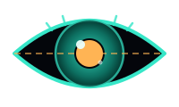

<div align="center">



# dsh-eye

> 把每一个纯文本模型，变成能看图、能画画的完整 Agent。

**dsh-eye 是一个零依赖的 Agent Skill**：让 DeepSeek 这类不支持图片的模型，通过任意
**OpenAI 兼容端点**完成看图（描述 / 问答 / OCR）与画图（文字生成图片）。看图与画图
后端完全独立配置，一键向导，配置即时生效。


</div>

---

## 为什么做这个

DeepSeek 很聪明，但它看不见。大多数方案让用户"切换支持图片的模型"，而 dsh-eye 的
思路相反：**给模型装上眼睛和手**。让模型在"看图"这件事上不依赖自身的多模态能力，
而是调用视觉 API 替它完成——这对所有纯文本模型（DeepSeek、各类本地小模型）都成立。

项目最初以 DSH 插件形式开发并发布，后来为了**更简单的分发与使用**整体重构为 Skill：
一个文件夹、一份 SKILL.md、两个零依赖脚本，复制即用。

## 功能

| | 看图（vision） | 画图（generation） |
|---|---|---|
| 脚本 | `vision.mjs` | `generate.mjs` |
| 能力 | 描述 · 视觉问答 · OCR | 文字 → 图片 |
| 端点 | OpenAI 兼容 `/chat/completions` | OpenAI 兼容 `/images/generations` |
| 预设 | `glm`（免费）· `qwen` · `openai` · `ollama` | `glm` · `qwen` · `openai` |
| 配置 | **与画图完全独立** | 可一键复用看图配置 |

- **零依赖**：只用 Node 内置模块（`fetch` / `fs` / `path`），复制即用
- **配置即时生效**：脚本自动读取用户级配置（`~/.dsh-eye.json` + Windows 注册表），
  改完配置无需重启任何程序，沙箱环境也能读到
- **友好错误**：缺 Key、格式异常、API 报错都有中文提示，并列出已检查的全部配置来源
- **不拒绝**：SKILL.md 明确要求模型"有工具就用"，从根上消除"模型不支持图片"的尴尬
- **来源三格式**：本地路径 / http(s) URL / data URI 全部支持

## 工作原理

```text
Agent 会话（DeepSeek 等纯文本模型）
   │  用户：看看这张图 C:\x\a.png
   ▼
dsh-eye skill（SKILL.md 触发）
   │  node scripts\vision.mjs "C:\x\a.png"
   ▼
vision.mjs
   │  ① 读取配置：参数 > 环境变量 > ~/.dsh-eye.json > 注册表 > 预设
   │  ② 读取图片字节 → base64 data URI
   │  ③ POST {baseUrl}/chat/completions（image_url 内容块）
   ▼
OpenAI 兼容视觉端点（智谱 / 千问 / OpenAI / Ollama …）
   │  返回文字描述
   ▼
模型把结果组织成回答呈现给用户
```

画图同理：`generate.mjs` 调用 `/images/generations`，保存图片到
`%DSH_HOME%\storages\dsh-eye\`（未设置 DSH_HOME 时用系统临时目录），输出文件路径。

## 快速开始（3 步）

```powershell
# ① 把 dsh-eye 文件夹放进你的 skills 目录（例如 $env:USERPROFILE\.agents\skills\）
# ② 运行配置向导（交互式：看图端点 → 模型 → Key → 画图，可复用看图配置）
powershell -ExecutionPolicy Bypass -File "$env:USERPROFILE\.agents\skills\dsh-eye\scripts\setup.ps1"

# ③ 让模型使用它 —— 分享图片路径 / URL，或要求画图
```

> 💡 `$env:USERPROFILE` 是 PowerShell 写法；在 cmd 里用 `%USERPROFILE%`，效果相同。

> ⚠️ **新手必读 · 第 1 条**：使用 DeepSeek 等纯文本模型时，**不要直接在对话框里粘贴图片**
> ——系统会拒绝图片内容。请发送图片的**文件路径或网址**（如 `看看这张图 C:\Users\你\Pictures\test.png`），
> 模型会通过本 skill 自动"看"图。
>
> 💡 **配置即时生效**：脚本会自动读取你的用户级配置（`~/.dsh-eye.json` 与注册表），
> 向导写完后**无需重启任何程序**，新的一次调用立即使用新配置。

> 手动配置同样简单：`$env:DASHEYE_API_KEY = "sk-xxx"` 即可起步
> （默认走智谱 `glm-4v-flash` 免费模型，画图默认 `cogview-3-flash`）。

## 使用方式

脚本位于 `<skill路径>\scripts\`，通过 `node` 执行。

```bash
# 看图：描述
node dsh-eye/scripts/vision.mjs "C:\Users\me\Pictures\test.png"

# 看图：针对图片提问
node dsh-eye/scripts/vision.mjs "https://example.com/a.png" "图里有多少只猫？" --mode ask

# 看图：OCR 提取文字
node dsh-eye/scripts/vision.mjs "C:\x\scan.png" --mode ocr

# 画图：生成图片（保存到 %DSH_HOME%\storages\dsh-eye\）
node dsh-eye/scripts/generate.mjs "一只赛博朋克风格的猫，霓虹灯，雨夜"

# 临时覆盖配置（不改任何文件）
node dsh-eye/scripts/vision.mjs "C:\x\a.png" --base-url https://api.openai.com/v1 --model gpt-4o --api-key sk-xxx
```

## 配置

配置来源优先级：**命令行参数 > 环境变量 > `~/.dsh-eye.json` > Windows 注册表 > 预设 > 内置默认**。

| 变量 | 用途 | 回退顺序 |
|---|---|---|
| `DASHEYE_BASE_URL` · `DASHEYE_MODEL` · `DASHEYE_API_KEY` | 看图 | 参数 > 环境变量 > 文件/注册表 > 预设 |
| `DASHEYE_GEN_BASE_URL` · `DASHEYE_GEN_MODEL` · `DASHEYE_GEN_API_KEY` | 画图 | 参数 > 环境变量 > 文件/注册表 > 看图配置 |
| `DASHEYE_GEN_OUT` | 画图输出目录 | 默认 storages / tmp |
| `DASHEYE_PRESET` / `DASHEYE_GEN_PRESET` | 看图 / 画图预设 | — |
| `OPENAI_API_KEY` | 通用兜底 Key | — |

常用端点速查：

| 预设 | 看图端点 | 看图模型 | 画图模型 |
|---|---|---|---|
| `glm` | `open.bigmodel.cn/api/paas/v4` | `glm-4v-flash`（免费） | `cogview-3-flash` |
| `qwen` | `dashscope.aliyuncs.com/compatible-mode/v1` | `qwen-vl-max` | `wanx2.1-t2i-flash` |
| `openai` | `api.openai.com/v1` | `gpt-4o` | `gpt-image-1` |
| `ollama` | `localhost:11434/v1`（本地） | `llava` | — |

## 数据与隐私

- **图片发往哪**：只发给你配置的视觉/绘图端点（`DASHEYE_*_BASE_URL`），脚本不中转、不记录；
- **API Key 存哪**：只存在你本机（`~/.dsh-eye.json` 与用户级注册表），**不随仓库分发、不上传**；
- **无遥测**：脚本没有任何统计、埋点或网络回传，离线可用（本地 Ollama 场景完全离线）；
- 若使用「自定义」端点，图片与 Key 直接发往你填写的地址，由该服务商的政策约束。

## 费用

看图与画图按你选择的模型定价计费。入门零成本组合：

- 智谱 `glm-4v-flash`（看图）与 `cogview-3-flash`（画图）免费；
- 本地 Ollama + `llava` 完全离线免费。

## 常见问题

- **环境变量里看不到 `DASHEYE_API_KEY`（但 BASE_URL/MODEL 在）**：这是正常的——安全沙箱会
  **隐藏密钥类环境变量**。直接运行脚本即可，它会自动从 `~/.dsh-eye.json` / 注册表读取。
- **报"未配置 API Key"**：运行 `setup.ps1` 配置（会同时写入配置文件与注册表），或手动设置
  `DASHEYE_API_KEY`（画图用 `DASHEYE_GEN_API_KEY`）。
- **图片是粘贴进对话的（不是路径/URL）**：纯文本模型无法获得图片字节，请提供路径或 URL。
- **画图报错 4xx**：确认画图端点支持 `/images/generations` 且模型名正确；部分免费模型
  仅支持特定尺寸，可加 `--size 1024x1024`。
- **中文描述效果不佳**：生成图片时可在描述后追加英文关键词，效果通常更好。

## 开发与测试

```bash
node test/run-tests.mjs   # 端到端测试：mock OpenAI 兼容 API，无需真实 Key（12 项断言）
powershell -ExecutionPolicy Bypass -File dsh-eye/scripts/setup.ps1 -DryRun  # 向导预览
```

测试隔离：`DASHEYE_IGNORE_USER_ENV=1` 可让脚本忽略本机用户级配置，保证测试确定性。

## 目录结构

```
dsh-eye/
├── SKILL.md              # skill 清单：触发规则 + 使用指南
├── scripts/
│   ├── vision.mjs        # 看图：描述 / 问答 / OCR（多后端，零依赖）
│   ├── generate.mjs      # 画图：文字 → 图片（自动保存 + 格式识别）
│   └── setup.ps1         # 一键配置向导（注册表 + 配置文件双写）
└── assets/
    └── eye.svg           # logo
```

## 路线图

- [ ] macOS / Linux 配置向导（当前向导面向 Windows，脚本本身全平台可用）
- [ ] 更多预设（Gemini、本地 vLLM 模板）
- [ ] 图片缩放预处理（大图自动压缩，省 token）
- [ ] 结果缓存（重复看图不重复计费）
- [ ] 生成图片直接作为附件回传

## 致谢

- [dsh-plugin-deepeye](https://www.npmjs.com/package/dsh-plugin-deepeye)：最初插件形态的参考实现；
- 本项目早期以 DSH 插件形式发布（已下架），重构为 Skill 后更简单、更好分发；
- DeepSeek Harness 生态：skill 机制的载体。

## 许可证

[MIT](LICENSE)
